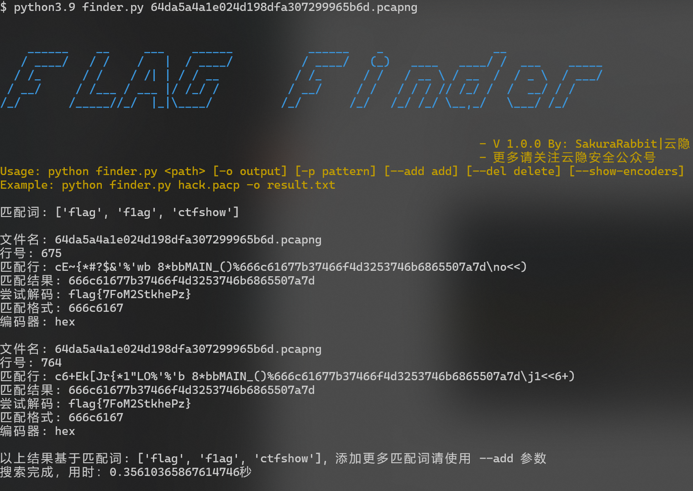
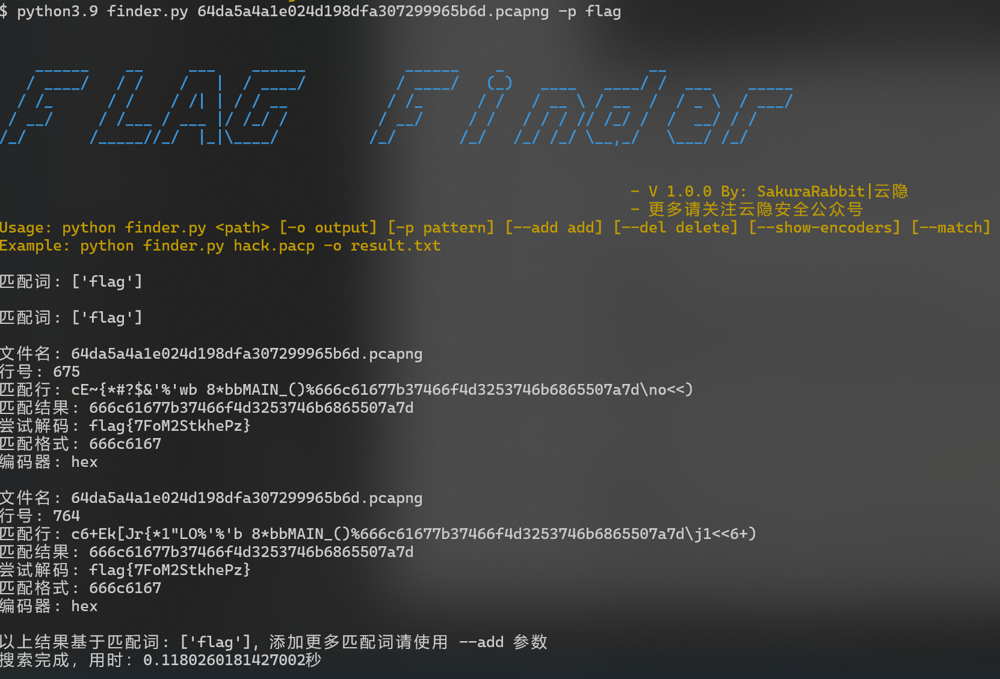
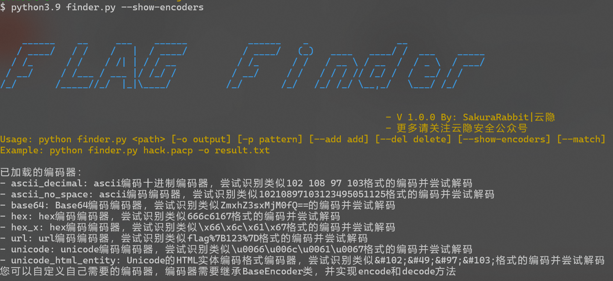
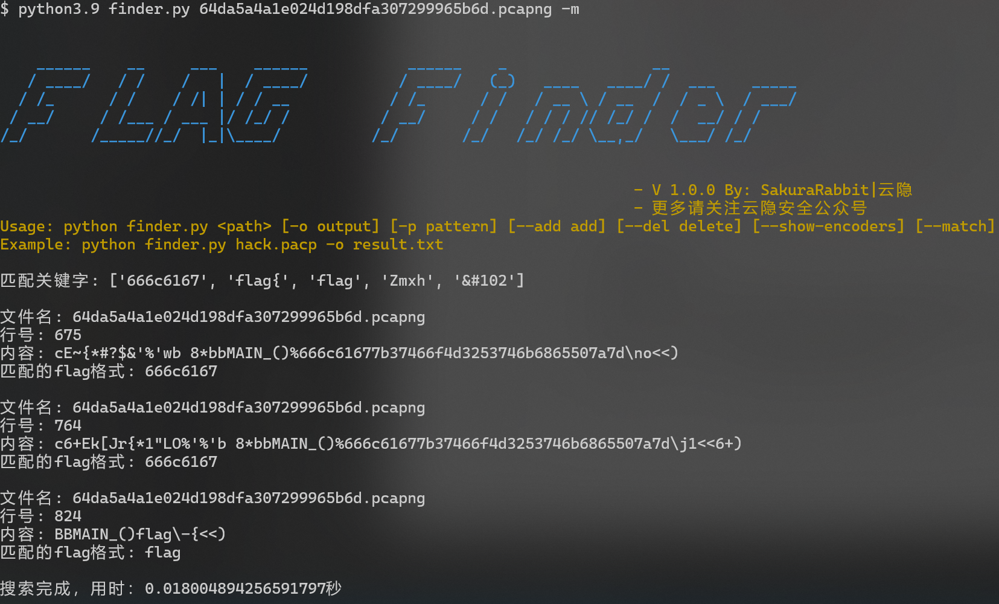

# FlagFinder
CTF比赛中自动查找FLAG，支持多种编码自动编码，一键梭哈
## 简介

flagFinder是一款自动查找flag并尝试自动解密的工具，可以尝试通过关键字一键找出flag，在流量分析或者隐写中可以尝试一键梭哈。

**功能特色**

+ 自动识别单文件与文件夹，当路径是文件时自动分析文件，当路径是文件夹时将自动分析文件夹下所有文件。
+ 支持自动将关键字编码为多种编码并进行匹配，如flag将会被编码为：
  + hex：666c6167
  + base64：Zmxh
  + ascii_bin：01100110011011000110000101100111
  + unicode_entity：`&#102;&#49;&#97;&#103;`
  + ...........
+ 支持匹配关键词后尝试自动解码，如匹配到666c6167格式的hex编码将自动解码为flag。
+ 支持自定义编码解码，如果需要自定义编码只需编写自己的编码类即可。

## 使用

**基本用法**

```cmd
python finder.py your_file
```

如图，执行命令`python3.9 finder.py 64da.pcapng`

首行将列出匹配词，如图有`flag`、`f1lg`等，flagFinder将自动将其这些匹配词编码为hex编码、Unicode编码等并进行匹配，使用--show-encoders参数可以看到所有支持的编码。

如图，自动匹配到了flag的hex编码，并尝试自动解码解码出flag



**以指定的匹配词匹配**

使用-p参数指定匹配词，将仅基于这一个匹配词进行匹配

```sh
python finder.py your_file -p flag
```



**添加匹配词**

又很多比赛的flag头是自定义的，如有的flag形如`BJD{pyth0n_Brut3_f0rc3_oR_quipquip_AI_Cr4cy}`，这个时候我们就可以使用--add参数添加自定义的flag头以供查找，添加的匹配词会自动进行hex编码等进行查找

```sh
python finder.py --add BJD ctfshow #支持同时添加多个
```

**删除匹配词**

过多匹配词会增加搜索时间，尤其是多文件批量搜索的时候，所以可以将不需要的匹配词删掉以减少搜索时间，使用--del参数删除匹配词

```sh
python finder.py --del BJD 
```

**指定输出文件**

可以将搜索结果使用-o参数输出到结果文件以供查看

```sh
python finder.py your_file -o result.txt
```

**查看支持的编码器**

flagFinder支持自动编码，得益于拥有众多编码器，可以使用--show-encoders参数查看支持哪些编码器

```sh
python finder.py --show-encoders
```



**自定义编码器**

编码器只有常见的编码，如果没有您需要的编码格式，您可以自己自定义编码器，欢迎各位师傅进行二开。

自定义编码器，只需要在`encode_class`文件夹下创建一个类，并继承BaseEncoder类即可，模板如下：

```sh
from encode_class import BaseEncoder

class YourEncode(BaseEncoder):
    def __init__(self):
        super().__init__()
        self.name = '自定义编码器的名称'
        self.description = '对编码器的描述'

    def encode(self):
    	# 自定义编码
        return #返回编码后的值
    
    def decode(self, text):
        try:
            return # 返回解码后的值
        except:
            return None # 解码失败返回None即可
    
    def generate_regex(self):
        return # 需要您自己编写正则匹配您自定义的编码内容
```

以处理Hex编码的编码器为例，如下：

```python
import re
from encode_class import BaseEncoder


class HexEncoder(BaseEncoder):
    def __init__(self):
        super().__init__()
        self.name = 'hex'  
        self.description = 'hex编码编码器，尝试识别类似666c6167格式的编码并尝试解码'

    def encode(self):
        return self.text.encode('utf-8').hex()

    def decode(self,text):
        try:
            return bytes.fromhex(text).decode('utf-8')
        except:
            return None
    
    def generate_regex(self):
        # 生成匹配编码文本开头的正则表达式
        # 取编码后文本的前8个字符（或更少）
        hex_prefix = self.encode_text[:min(len(self.encode_text), 8)] 
        return r'' + re.escape(hex_prefix) + r'[0-9a-fA-F]*'

# 测试代码
# 注意测试的时候需要将头部的from encode_class import BaseEncoder换成from BaseEncoder import BaseEncoder
if __name__ == '__main__':
    str = "-1%27+union+select+0x3C3F70687020247374723D2255563C4F424C3E4C42483C5452473E4755523C53594E543E223B206563686F2822666C61677B222E7374725F726F7431332824737472292E227D22293B3F3E,2+into+outfile+%27/var/www/html/822666C61677B222E7374725F726F74313328247374.php%27--+&Submit=Submit HTTP/1.1"
    encoder = HexEncoder()
    encoder.set_text("flag")
    pattern = re.compile(encoder.re,re.IGNORECASE)
    print(encoder.re)
    result = pattern.findall(str)[0]
    if result:
        print(encoder.decode(result))
    else:
        print("No match found")

```

**以关键词搜索**

使用`-m`参数将以关键词搜索，关键词仅仅匹配关键词，将不在进行自动编码，减少性能开支，但该模式仅支持匹配不支持自动解码，使用--add-match添加新的关键词，--del-match删除不需要的关键词

```sh
python3.9 finder.py your_file -m
```




